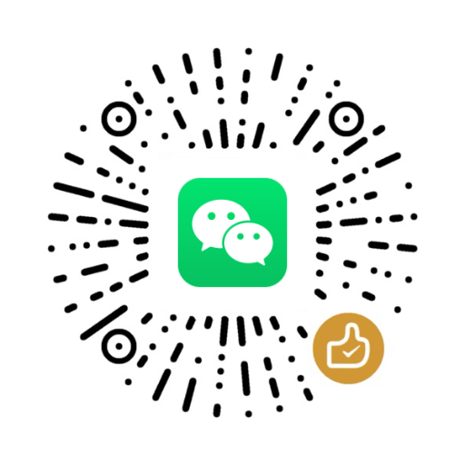

# zhipu

[](https://pkg.go.dev/github.com/yankeguo/zhipu)
[](https://github.com/yankeguo/zhipu/actions/workflows/go.yml)

A 3rd-Party Golang Client Library for Zhipu AI Platform

## Usage

### Install the package

```bash
go get -u github.com/yankeguo/zhipu
```

### Create a client

```go
// this will use environment variables ZHIPUAI_API_KEY
client, err := zhipu.NewClient()
// or you can specify the API key
client, err = zhipu.NewClient(zhipu.WithAPIKey("your api key"))
```

### Use the client

**ChatCompletion**

```go
service := client.ChatCompletion("glm-4-flash").
    AddMessage(zhipu.ChatCompletionMessage{
        Role: "user",
        Content: "你好",
    })

res, err := service.Do(context.Background())

if err != nil {
    zhipu.GetAPIErrorCode(err) // get the API error code
} else {
    println(res.Choices[0].Message.Content)
}
```

**ChatCompletion (Stream)**

```go
service := client.ChatCompletion("glm-4-flash").
    AddMessage(zhipu.ChatCompletionMessage{
        Role: "user",
        Content: "你好",
    }).SetStreamHandler(func(chunk zhipu.ChatCompletionResponse) error {
        println(chunk.Choices[0].Delta.Content)
        return nil
    })

res, err := service.Do(context.Background())

if err != nil {
    zhipu.GetAPIErrorCode(err) // get the API error code
} else {
    // this package will combine the stream chunks and build a final result mimicking the non-streaming API
    println(res.Choices[0].Message.Content)
}
```

**Embedding**

```go
service := client.Embedding("embedding-v2").SetInput("你好呀")
service.Do(context.Background())
```

**Image Generation**

```go
service := client.ImageGeneration("cogview-3").SetPrompt("一只可爱的小猫咪")
service.Do(context.Background())
```

**Upload File (Retrieval)**

```go
service := client.FileCreate(zhipu.FilePurposeRetrieval)
service.SetLocalFile(filepath.Join("testdata", "test-file.txt"))
service.SetKnowledgeID("your-knowledge-id")

service.Do(context.Background())
```

**Upload File (Fine-Tune)**

```go
service := client.FileCreate(zhipu.FilePurposeFineTune)
service.SetLocalFile(filepath.Join("testdata", "test-file.jsonl"))
service.Do(context.Background())
```

**Batch Create**

```go
service := client.BatchCreate().
  SetInputFileID("fileid").
  SetCompletionWindow(zhipu.BatchCompletionWindow24h).
  SetEndpoint(BatchEndpointV4ChatCompletions)
service.Do(context.Background())
```

**Knowledge Base**

```go
client.KnowledgeCreate("")
client.KnowledgeEdit("")
```

**Fine Tune**

```go
client.FineTuneCreate("")
```

### Batch Support

**Batch File Writer**

```go
f, err := os.OpenFile("batch.jsonl", os.O_CREATE|os.O_WRONLY, 0644)

bw := zhipu.NewBatchFileWriter(f)

bw.Add("action_1", client.ChatCompletion("glm-4-flash").
    AddMessage(zhipu.ChatCompletionMessage{
        Role: "user",
        Content: "你好",
    }))
bw.Add("action_2", client.Embedding("embedding-v2").SetInput("你好呀"))
bw.Add("action_3", client.ImageGeneration("cogview-3").SetPrompt("一只可爱的小猫咪"))
```

**Batch Result Reader**

```go
br := zhipu.NewBatchResultReader[zhipu.ChatCompletionResponse](r)

for {
    var res zhipu.BatchResult[zhipu.ChatCompletionResponse]
    err := br.Read(&res)
    if err != nil {
        break
    }
}
```

## Donation

微信扫码捐赠，感谢您的支持！



## Credits

GUO YANKE, MIT License
